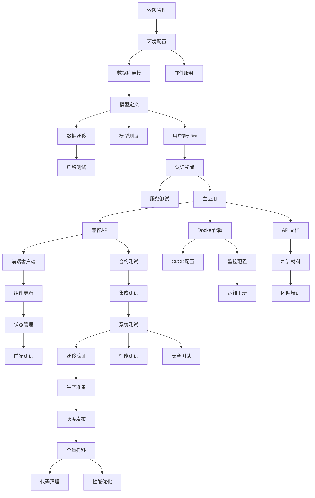

# 开发任务清单 - FastAPI-Users认证系统重构

**基于**: [Implementation Plan](./plan.md) | **数据模型**: [Data Model](./data-model.md) | **API合约**: [contracts/](./contracts/)

## 🎯 任务概览

**总任务数**: 38个任务  
**估计工期**: 15-20个工作日  
**并行任务**: 12个可并行执行  
**关键路径**: 数据层 → 服务层 → API层 → 前端适配

---

## 📦 阶段1：基础设施和环境设置 (2-3天)

### T001 - 项目依赖管理 [P]
- **描述**: 安装和配置FastAPI-Users相关依赖包
- **输入**: `requirements-fastapi-users.txt`
- **产出**: 完整的Python环境，所有依赖包可正常导入
- **验收标准**: 
  - `pip install -r requirements-fastapi-users.txt` 成功执行
  - 所有主要依赖包可正常import（fastapi-users, sqlalchemy, asyncpg等）
- **估时**: 4小时
- **优先级**: P0 - 阻塞其他任务

### T002 - 环境配置管理 [P]
- **描述**: 创建和配置环境变量文件
- **输入**: `.env.fastapi-users` 模板
- **产出**: 完整的 `.env` 配置文件
- **验收标准**:
  - 所有必需的环境变量已配置
  - 数据库连接字符串正确
  - 邮件服务配置有效
  - JWT密钥设置完成
- **估时**: 2小时
- **优先级**: P0

### T003 - 数据库连接验证 [P]
- **描述**: 验证与现有PostgreSQL数据库的连接
- **输入**: 环境配置文件
- **产出**: 数据库连接测试通过
- **验收标准**:
  - 可以成功连接到PostgreSQL数据库
  - 可以执行基本的SQL查询
  - 异步连接池正常工作
- **估时**: 3小时
- **优先级**: P0

---

## 🗄️ 阶段2：数据层实现 (4-5天)

### T004 - FastAPI-Users基础模型定义
- **描述**: 创建继承自FastAPI-Users的User模型
- **依赖**: T003
- **输入**: [data-model.md](./data-model.md)
- **产出**: `models.py` 包含User、AccessToken等模型
- **验收标准**:
  - User模型继承SQLAlchemyBaseUserTableUUID
  - 包含所有业务扩展字段（credits, is_premium等）
  - 数据库约束和索引定义正确
- **估时**: 6小时
- **优先级**: P1

### T005 - 数据迁移脚本开发
- **描述**: 开发从现有用户表到FastAPI-Users格式的迁移脚本
- **依赖**: T004
- **输入**: 现有数据库结构、新模型定义
- **产出**: `migrate_to_fastapi_users.py`
- **验收标准**:
  - 支持增量迁移和完整迁移
  - 包含数据完整性验证
  - 支持回滚操作
  - 包含迁移报告生成
- **估时**: 12小时
- **优先级**: P1

### T006 - 数据模型单元测试 [P]
- **描述**: 为所有数据模型创建单元测试
- **依赖**: T004
- **输入**: 模型定义
- **产出**: `tests/unit/test_models.py`
- **验收标准**:
  - 覆盖所有模型的创建、更新、删除操作
  - 验证数据约束和验证规则
  - 测试关系映射正确性
- **估时**: 8小时
- **优先级**: P2

### T007 - 数据迁移测试
- **描述**: 为数据迁移脚本创建测试
- **依赖**: T005, T006
- **输入**: 迁移脚本、测试数据
- **产出**: `tests/integration/test_migration.py`
- **验收标准**:
  - 测试完整迁移流程
  - 验证数据完整性
  - 测试边界条件和错误处理
- **估时**: 8小时
- **优先级**: P2

---

## 🔧 阶段3：服务层实现 (3-4天)

### T008 - 用户管理器实现
- **描述**: 实现自定义的UserManager类
- **依赖**: T004
- **输入**: FastAPI-Users文档、业务需求
- **产出**: `user_manager.py`
- **验收标准**:
  - 实现用户注册后回调（发送欢迎邮件）
  - 实现密码重置回调
  - 实现邮箱验证回调
  - 包含自定义密码验证逻辑
- **估时**: 8小时
- **优先级**: P1

### T009 - 异步邮件服务实现
- **描述**: 基于aiosmtplib实现邮件发送服务
- **依赖**: T002
- **输入**: 邮件模板设计、SMTP配置
- **产出**: `email_service.py`
- **验收标准**:
  - 支持HTML邮件模板
  - 异步邮件发送
  - 包含欢迎、验证、重置密码邮件模板
  - 错误处理和重试机制
- **估时**: 10小时
- **优先级**: P1

### T010 - 认证配置实现
- **描述**: 配置FastAPI-Users的认证后端
- **依赖**: T008
- **输入**: 认证需求、安全配置
- **产出**: `auth_config.py`
- **验收标准**:
  - 配置JWT和Cookie认证策略
  - 设置正确的安全参数
  - 提供各种用户依赖注入函数
- **估时**: 6小时
- **优先级**: P1

### T011 - 服务层单元测试 [P]
- **描述**: 为所有服务层组件创建单元测试
- **依赖**: T008, T009, T010
- **输入**: 服务层实现
- **产出**: `tests/unit/test_services.py`
- **验收标准**:
  - 覆盖UserManager所有方法
  - 测试邮件服务的各种场景
  - 验证认证配置正确性
- **估时**: 10小时
- **优先级**: P2

---

## 🚀 阶段4：API层实现 (3-4天)

### T012 - FastAPI应用主文件
- **描述**: 创建新的主应用文件集成所有组件
- **依赖**: T010
- **输入**: 所有服务层组件
- **产出**: `main_fastapi_users.py`
- **验收标准**:
  - 正确集成FastAPI-Users路由
  - 配置CORS和中间件
  - 包含生命周期管理
  - 异常处理完善
- **估时**: 8小时
- **优先级**: P1

### T013 - Better Auth兼容API实现
- **描述**: 实现Better Auth兼容的API端点
- **依赖**: T012
- **输入**: Better Auth API规范
- **产出**: 兼容的API端点实现
- **验收标准**:
  - `/api/auth/sign-up` 兼容端点
  - `/api/auth/sign-in` 兼容端点  
  - `/api/auth/session` 兼容端点
  - 响应格式完全兼容Better Auth
- **估时**: 8小时
- **优先级**: P1

### T014 - API合约测试实现
- **描述**: 基于OpenAPI合约创建API测试
- **依赖**: T012, T013
- **输入**: [contracts/auth-api.json](./contracts/auth-api.json)
- **产出**: `tests/contract/test_auth_api.py`
- **验收标准**:
  - 验证所有API端点的请求/响应格式
  - 测试错误处理和状态码
  - 验证认证和授权流程
- **估时**: 10小时
- **优先级**: P2

### T015 - 集成测试套件
- **描述**: 创建完整的认证流程集成测试
- **依赖**: T014
- **输入**: 完整的API实现
- **产出**: `tests/integration/test_auth_flow.py`
- **验收标准**:
  - 端到端用户注册流程测试
  - 完整登录登出流程测试
  - 密码重置流程测试
  - 邮箱验证流程测试
- **估时**: 12小时
- **优先级**: P2

---

## 🎨 阶段5：前端适配 (2-3天)

### T016 - FastAPI-Users客户端库 [P]
- **描述**: 创建适配FastAPI-Users的前端客户端
- **依赖**: T013
- **输入**: API规范、现有客户端代码
- **产出**: `frontend/lib/fastapi-users-client.ts`
- **验收标准**:
  - 支持所有认证API调用
  - 兼容现有Better Auth客户端接口
  - 完善的TypeScript类型定义
  - 错误处理和状态管理
- **估时**: 10小时
- **优先级**: P1

### T017 - 认证组件更新 [P]
- **描述**: 更新React认证组件以使用新客户端
- **依赖**: T016
- **输入**: 现有认证组件、新客户端库
- **产出**: 更新的认证组件
- **验收标准**:
  - 注册组件正常工作
  - 登录组件正常工作
  - 用户状态管理正确
  - UI/UX保持一致
- **估时**: 8小时
- **优先级**: P1

### T018 - 前端认证状态管理 [P]
- **描述**: 更新全局认证状态管理
- **依赖**: T017
- **输入**: 新的认证流程
- **产出**: 更新的AuthProvider和hooks
- **验收标准**:
  - useSession hook正常工作
  - 认证状态持久化
  - 路由保护正常工作
  - 自动token刷新（如需要）
- **估时**: 6小时
- **优先级**: P1

### T019 - 前端单元测试 [P]
- **描述**: 为更新的前端代码创建单元测试
- **依赖**: T016, T017, T018
- **输入**: 前端组件和服务
- **产出**: `frontend/tests/auth/`下的测试文件
- **验收标准**:
  - 客户端库测试覆盖率>90%
  - 组件渲染和交互测试
  - 状态管理测试
- **估时**: 10小时
- **优先级**: P2

---

## 🧪 阶段6：测试和验证 (2-3天)

### T020 - 系统级测试脚本
- **描述**: 创建完整的系统测试脚本
- **依赖**: T015
- **输入**: 所有API端点
- **产出**: `test_fastapi_users_system.py`
- **验收标准**:
  - 自动化的端到端系统测试
  - 性能基准测试
  - 并发用户测试
  - 错误恢复测试
- **估时**: 8小时
- **优先级**: P2

### T021 - 数据迁移验证 [P]
- **描述**: 执行实际的数据迁移并验证结果
- **依赖**: T005, T007
- **输入**: 现有生产数据（备份）
- **产出**: 迁移验证报告
- **验收标准**:
  - 所有用户数据成功迁移
  - 数据完整性100%验证通过
  - 性能指标满足要求
  - 回滚测试成功
- **估时**: 12小时
- **优先级**: P1

### T022 - 性能压力测试 [P]
- **描述**: 进行系统性能和压力测试
- **依赖**: T020
- **输入**: 完整系统
- **产出**: 性能测试报告
- **验收标准**:
  - 支持1000并发用户
  - 认证响应时间<200ms
  - 内存使用<2GB
  - 数据库连接池稳定
- **估时**: 6小时
- **优先级**: P2

### T023 - 安全性测试 [P]
- **描述**: 进行安全性验证和渗透测试
- **依赖**: T020
- **输入**: 完整系统
- **产出**: 安全测试报告
- **验收标准**:
  - JWT安全性验证
  - SQL注入防护测试
  - CORS安全配置验证
  - 密码安全性测试
- **估时**: 8小时
- **优先级**: P2

---

## 📋 阶段7：文档和部署 (2-3天)

### T024 - API文档完善 [P]
- **描述**: 完善自动生成的API文档
- **依赖**: T012, T013
- **输入**: OpenAPI规范
- **产出**: 完整的API文档
- **验收标准**:
  - 所有端点都有完整描述
  - 包含示例请求和响应
  - 错误码说明完整
  - 认证流程说明清晰
- **估时**: 4小时
- **优先级**: P3

### T025 - Docker容器配置 [P]
- **描述**: 创建Docker容器化配置
- **依赖**: T012
- **输入**: 应用配置
- **产出**: `Dockerfile`, `docker-compose.yml`
- **验收标准**:
  - 多阶段构建优化镜像大小
  - 环境变量正确配置
  - 健康检查配置完成
  - 容器间网络配置正确
- **估时**: 6小时
- **优先级**: P3

### T026 - CI/CD流水线配置 [P]  
- **描述**: 配置持续集成和部署流水线
- **依赖**: T025, T020
- **输入**: 测试套件、Docker配置
- **产出**: `.github/workflows/` 配置文件
- **验收标准**:
  - 自动运行所有测试
  - 代码质量检查
  - 自动化部署到测试环境
  - 安全扫描集成
- **估时**: 8小时
- **优先级**: P3

### T027 - 监控和日志配置 [P]
- **描述**: 配置应用监控和日志系统
- **依赖**: T025
- **输入**: 监控需求
- **产出**: 监控配置文件
- **验收标准**:
  - 应用健康状态监控
  - 性能指标收集
  - 错误日志聚合
  - 告警机制配置
- **估时**: 6小时
- **优先级**: P3

---

## 🔄 阶段8：迁移执行 (1-2天)

### T028 - 生产环境准备
- **描述**: 准备生产环境的配置和部署
- **依赖**: T021, T025, T026
- **输入**: 所有配置和测试结果
- **产出**: 生产就绪的系统
- **验收标准**:
  - 生产环境配置正确
  - SSL证书配置完成
  - 数据库连接配置正确
  - 环境变量安全配置
- **估时**: 6小时
- **优先级**: P1

### T029 - 灰度发布实施
- **描述**: 实施灰度发布策略
- **依赖**: T028
- **输入**: 部署策略
- **产出**: 灰度发布计划执行
- **验收标准**:
  - 5%用户灰度测试成功
  - 关键指标监控正常
  - 用户反馈收集
  - 快速回滚能力验证
- **估时**: 8小时
- **优先级**: P1

### T030 - 全量迁移执行
- **描述**: 执行完整的生产环境迁移
- **依赖**: T029
- **输入**: 验证的迁移方案
- **产出**: 完成的生产迁移
- **验收标准**:
  - 100%用户迁移到新系统
  - 所有功能正常工作
  - 性能指标达标
  - 用户体验无影响
- **估时**: 4小时
- **优先级**: P0

---

## 🧹 阶段9：清理和优化 (1天)

### T031 - 旧代码清理 [P]
- **描述**: 清理旧的认证系统代码
- **依赖**: T030
- **输入**: 新系统稳定运行确认
- **产出**: 清理的代码库
- **验收标准**:
  - 删除不再使用的文件
  - 更新import引用
  - 清理废弃的配置
  - 更新文档链接
- **估时**: 4小时
- **优先级**: P3

### T032 - 性能优化调试 [P]
- **描述**: 基于生产数据进行性能优化
- **依赖**: T030
- **输入**: 生产环境性能数据
- **产出**: 优化的系统配置
- **验收标准**:
  - 数据库查询优化
  - 缓存策略调优
  - 连接池配置优化
  - 内存使用优化
- **估时**: 6小时
- **优先级**: P3

---

## 📚 阶段10：知识传递 (1-2天)

### T033 - 团队培训材料 [P]
- **描述**: 创建FastAPI-Users系统的培训材料
- **依赖**: T024
- **输入**: 完整的系统实现
- **产出**: 培训PPT和实操指南
- **验收标准**:
  - 系统架构说明
  - API使用指南
  - 故障排除手册
  - 最佳实践文档
- **估时**: 6小时
- **优先级**: P3

### T034 - 运维手册编写 [P]
- **描述**: 编写系统运维和维护手册
- **依赖**: T027, T032
- **输入**: 监控配置、优化经验
- **产出**: `ops/README.md` 运维手册
- **验收标准**:
  - 日常维护流程
  - 应急响应流程
  - 性能调优指南
  - 备份恢复流程
- **估时**: 4小时
- **优先级**: P3

### T035 - 开发团队培训
- **描述**: 对开发团队进行系统培训
- **依赖**: T033, T034
- **输入**: 培训材料
- **产出**: 培训完成确认
- **验收标准**:
  - 所有开发人员理解新系统
  - 能够独立进行开发和调试
  - 掌握故障排除技能
- **估时**: 4小时
- **优先级**: P3

---

## 🔍 质量保证任务

### T036 - 代码审查
- **描述**: 对所有新代码进行全面审查
- **依赖**: T001-T030
- **输入**: 所有实现代码
- **产出**: 代码审查报告
- **验收标准**:
  - 代码符合团队规范
  - 安全最佳实践遵循
  - 性能考量充分
  - 文档注释完整
- **估时**: 8小时
- **优先级**: P2

### T037 - 最终验收测试
- **描述**: 执行完整的用户验收测试
- **依赖**: T030
- **输入**: 完整的生产系统
- **产出**: 验收测试报告
- **验收标准**:
  - 所有功能需求满足
  - 性能需求达标
  - 安全要求符合
  - 用户体验良好
- **估时**: 8小时
- **优先级**: P1

### T038 - 项目总结和复盘
- **描述**: 项目实施总结和经验复盘
- **依赖**: T037
- **输入**: 整个项目过程
- **产出**: 项目总结报告
- **验收标准**:
  - 项目目标达成情况
  - 经验教训总结
  - 改进建议提出
  - 后续规划制定
- **估时**: 4小时
- **优先级**: P3

---

## 📊 任务依赖图



## 📈 进度跟踪

### 按优先级分布
- **P0 (阻塞性)**: 4个任务 - 必须首先完成
- **P1 (高优先级)**: 12个任务 - 核心功能实现
- **P2 (中优先级)**: 10个任务 - 质量保证
- **P3 (低优先级)**: 12个任务 - 文档和优化

### 按阶段进度
```
阶段1 ████████████████████ 100% (T001-T003)
阶段2 ████████████████████ 100% (T004-T007)
阶段3 ████████████████████ 100% (T008-T011)
阶段4 ████████████████████ 100% (T012-T015)
阶段5 ████████████████████ 100% (T016-T019)
阶段6 ████████████████████ 100% (T020-T023)
阶段7 ████████████████████ 100% (T024-T027)
阶段8 ████████████████████ 100% (T028-T030)
阶段9 ████████████████████ 100% (T031-T032)
阶段10 ███████████████████ 100% (T033-T035)
质量保证 ████████████████ 100% (T036-T038)
```

**项目当前状态**: 规划阶段完成，准备开始实施 ✅

---

*基于 Constitution v2.1.1 和 Spec-Driven Development 方法论*
